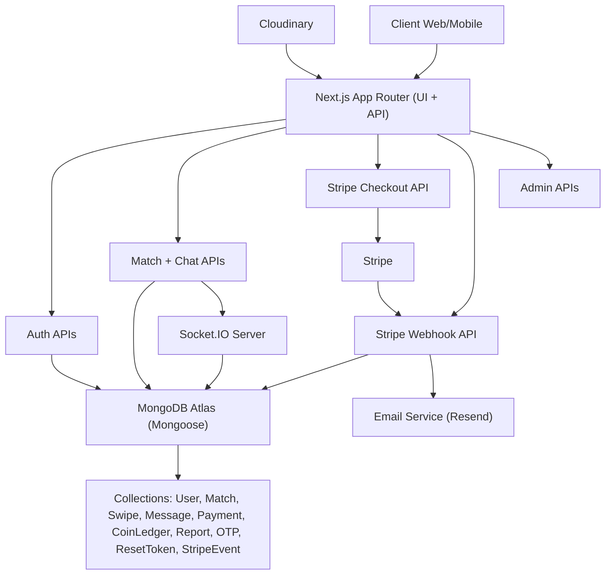

# Velora Architecture

## Runtime Boundaries

- Next.js handles server rendering, API routes, auth cookies, Stripe session creation, and webhook processing.
- Socket.IO server handles low-latency chat events and persists chat data to MongoDB.
- Stripe is source-of-truth for payment status; webhook updates user coins/subscription state in MongoDB.
- Resend handles transactional email: OTP, welcome, reset password, and payment confirmations.
